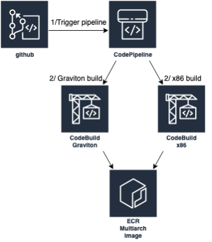
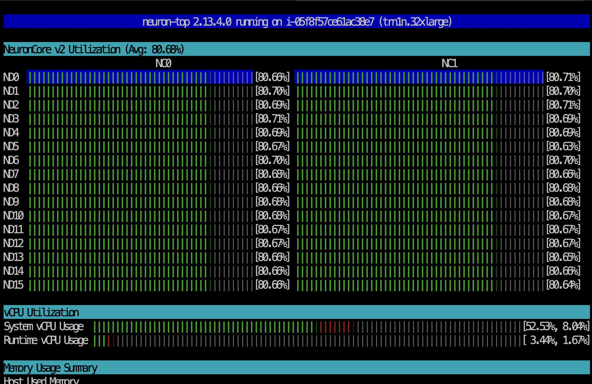

# EKS GPU and Trainuim Perceiver IO training 
Perceiver IO is a generalization of Perceiver to handle arbitrary outputs and arbitrary inputs. This example shows how to produce multimodal videos with audio using the [Kinetics](https://www.deepmind.com/open-source/kinetics) dataset on [AWS Trainium](https://aws.amazon.com/machine-learning/trainium/) and [EC2 GPU](https://aws.amazon.com/nvidia/) instances orchestrated by [EKS](https://aws.amazon.com/eks/) and launched by [Karpenter](https://karpenter.sh)

It is necessary to plan your application's build-time, deployment-time, and run-time to make it flexible with CPU and AI accelerators.   

To emphesize the build-time considurations, we started with a standalone instance (trn1n, p4d, g5) that downloads the kinetics datasets to the instance local NVMe SSD storage, prepares the data, train and evaluate a model. Later, we enabled the training to resume from interruptions by storing the dataset and training state on [Amazon FSx](https://aws.amazon.com/fsx/) to resolve data loading and performance bottlenecks. Finally, we use [Volcano](https://volcano.sh), a Kubernetes native batch scheduler, to improve training orchestration.   

We demonstrate how to simplify the build process by using a single Docker image for Trainuim and GPU instances. We start with [amazon-eks-gpu-node AMI](https://docs.aws.amazon.com/eks/latest/userguide/eks-optimized-ami.html) on Amazon Linux or Ubuntu. Then we build a Docker image that supports x86/AMD instances such as G5, P4, and Trn/Inf, as well as Graviton-based instances such as G5g. To abstract the AI accelerator chips, we use [Python venv](https://docs.python.org/3/tutorial/venv.html). CUDA for P and G instances and Neuron SDK for Trn and Inf instances.  

At deploy-time, we use Karpenter to simplify deployment by specifying a single deployment specification for the training job and using Karpenter to prioritize instance types based on availability and cost. For example, we use a Karpenter provisioner for Trn instances and another provisioner for GPU instances. The `.spec.weight` indicates the priority we want to set for each instance type. We can set more granular instance types by adding another Karpenter for G5G, which is a Graviton-based instance with NVIDIA T4G Tensor Core.    

## Setup
* [Create EKS cluster and deploy Karpenter](https://karpenter.sh/docs/getting-started/getting-started-with-karpenter/) 
* Deploy Karpenter provisioner for Trainuim
  ```bash
  kubectl apply -f amd-neuron-provisioner.yaml
  ```
* Deploy Karpenter provisioner for NVDIA-based instances
* Deploy FSx for Lustre [CSI driver](https://docs.aws.amazon.com/eks/latest/userguide/fsx-csi.html)
* Deploy the [Volcano CRD](https://volcano.sh/en/docs/installation/)
* Deploy [Container Insights on Amazon EKS](https://docs.aws.amazon.com/AmazonCloudWatch/latest/monitoring/Container-Insights-setup-EKS-quickstart.html)
* Deploy [NVIDIA device plugin for Kubernetes](https://github.com/NVIDIA/k8s-device-plugin)
  ```bash
  kubectl create -f https://raw.githubusercontent.com/NVIDIA/k8s-device-plugin/v0.14.1/nvidia-device-plugin.yml
  ```
* Deploy [Neuron device plugin for Kubernetes](https://awsdocs-neuron.readthedocs-hosted.com/en/latest/containers/tutorials/k8s-setup.html#tutorial-k8s-env-setup-for-neuron)
  ```bash
  kubectl apply -f k8s-neuron-device-plugin-rbac.yml
  kubectl apply -f k8s-neuron-device-plugin.yml
  ```

## Build the perceiver IO image
The build process creates OCI images for x86-based instances. You add another build step to create OCI images for Graviton-based instances. This new build process creates a OCI image manifest list that references both OCI images. The container runtime (Docker Engine or containerd) will pull the correct platform-specific image at deployment time. To automate the OCI image build process, we use AWS CodePipeline. AWS CodePipeline starts by building a OCI image from the code in AWS CodeBuild that is pushed to Amazon Elastic Container Registry (Amazon ECR). 


* [Deploy the CI-pipeline of the perceiver IO image](./ci-build)

## Deploy the training jobs on Trainuim 
We used the GLUE benchmark for hyperparameters settings ([Table 1 - Perceiver IO on language](https://arxiv.org/pdf/2107.14795.pdf)) for `SPS = train-time steps per second. M = # inputs and N = # latents` in [config/main.yaml](./app/config/main.yaml) and [perceiver-trn-job.yaml](./perceiver-trn-job.yaml). 

```
--------TRAINING CONFIG----------
Namespace(batch_size=1, config_file_path='config/main.yaml', dataset='kinetics-small', dataset_dir='/dataset', do_eval=False, drop_last=False, enable_pt_autocast=False, expected_average_throughput=0, image_dim=224, log_steps=4, logdir='log_training', lr=1e-05, max_steps=100, metrics_debug=False, momentum=0.9, num_epochs=1, num_workers=2, target_accuracy=0, test_batch_size=8)
---------------------------------
```

* Deploy training job on Trainium
  ```bash
  kubectl apply -f ./perceiver-trn-job.yaml
  ```
  The training includes the following phases:

  1/ [Download the training dataset](./app/prep_dataset.sh)

  2/ Run `PerceiverForMultimodalAutoencoding` using `torch.distributed.run`

  3/ Run `TrainiumTrainer` to prepar data `kubectl logs $POD_NAME | grep Preparing data.FLAGS.dataset`
  
     Results stored in `~/.torch/vision/datasets/kinetics/` e.g., `/root/.torch/vision/datasets/kinetics/1723303957.pt`

     Look for `Successfully built the dataset` i.e., `kubectl logs $POD_NAME | grep "Successfully built the dataset"`

  4/ Training start using neuron devices(`xla`)

  ```bash
  kubectl logs perceiver-trn-58c77f446c-vprlp | grep -A30 "Compiler status PASS"
  Compiler status PASS
  2023-09-30 19:55:36.000961: INFO ||NCC_WRAPPER||: Exiting with a successfully compiled graph
  2023-09-30 19:55:38.000516: INFO ||NCC_WRAPPER||: No candidate found under /var/tmp/neuron-compile-cache/USER_neuroncc-2.10.0.35+3817a0c8c/MODULE_6307988913499384240.
  2023-09-30 19:55:38.000517: INFO ||NCC_WRAPPER||: Cache dir for the neff: /var/tmp/neuron-compile-cache/USER_neuroncc-2.10.0.35+3817a0c8c/MODULE_6307988913499384240/MODULE_1_SyncTensorsGraph.4360_6307988913499384240_perceiver-trn-58c77f446c-vprlp-e2f5ebd3-526-60698ecd528fd/9c321fcf-f62f-4630-819e-e18a0e001854

  .......

  Compiler status PASS
  2023-09-30 19:57:45.000412: INFO ||NCC_WRAPPER||: Exiting with a successfully compiled graph
  2023-09-30 19:57:45.000413: INFO ||NCC_WRAPPER||: No candidate found under /var/tmp/neuron-compile-cache/USER_neuroncc-2.10.0.35+3817a0c8c/MODULE_875038235640162619.
  2023-09-30 19:57:45.000414: INFO ||NCC_WRAPPER||: Cache dir for the neff: /var/tmp/neuron-compile-cache/USER_neuroncc-2.10.0.35+3817a0c8c/MODULE_875038235640162619/MODULE_2_SyncTensorsGraph.18963_875038235640162619_perceiver-trn-58c77f446c-vprlp-ee1fe64d-526-60698eced10ee/ee2ad0db-252f-40e9-83fc-a3f751bbd984
  .| Training Device=xla:1 Epoch=1 Step=0 Learning_Rate=1e-05 Loss=0.09277 Throughput=8.76648 Time=2023-09-30 19:57:48.654494
  ```

  View the neuron-top to observe the neuron core usage.
  

* Deploy training job on G5 or P5 instances
TBD

* Deploy training job on G5g
TBD
