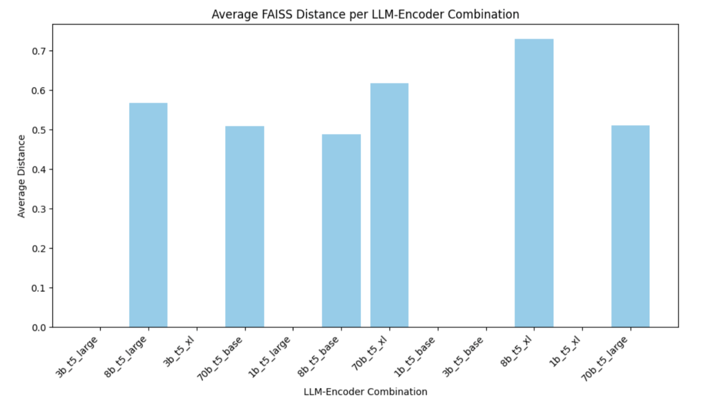
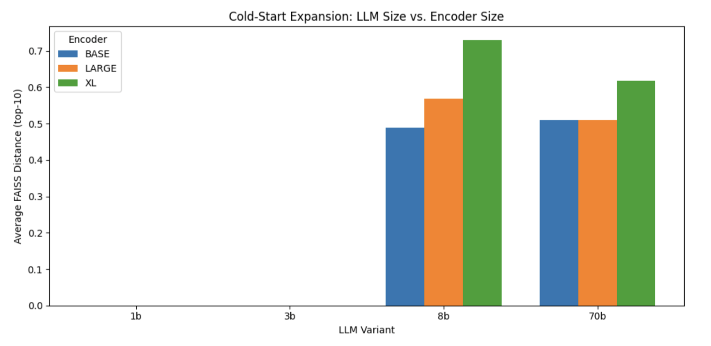
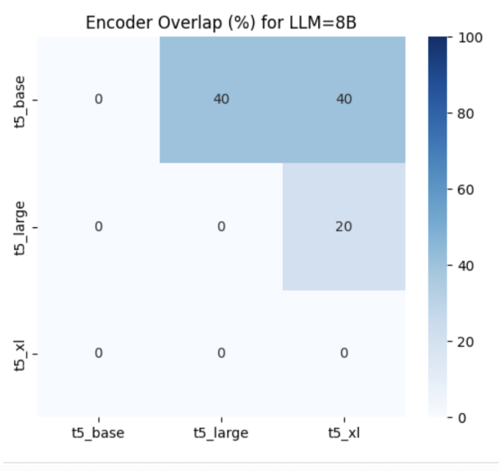
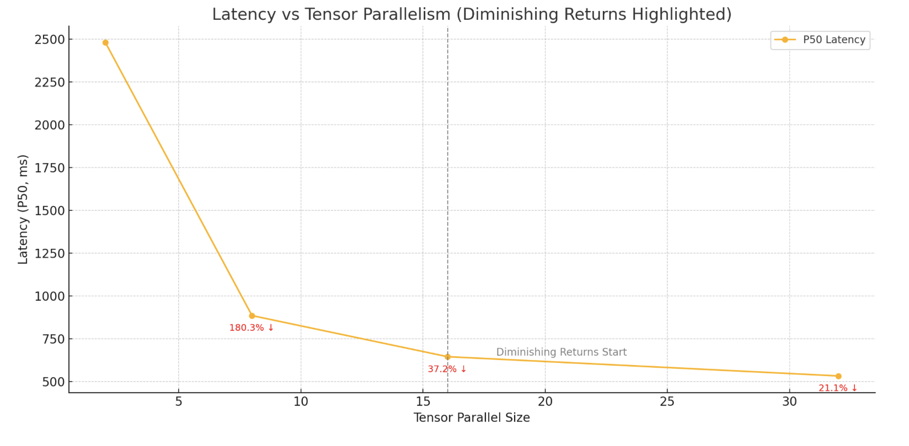
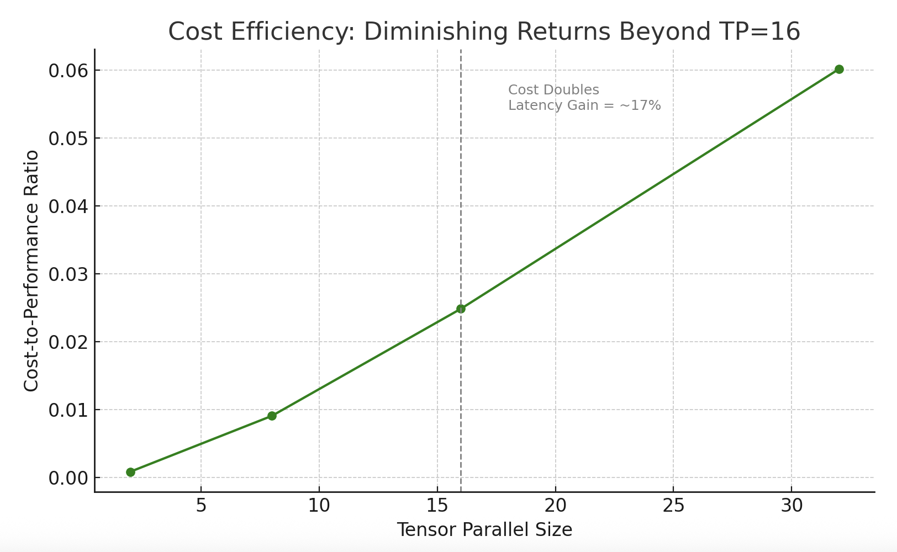

# ML Blog DRAFT - Solving the Cold-Start Problem in Recommendations with vLLM on AWS Trainium 

**Introduction: The Cold‑Start Challenge**
Cold start is a critical pain point in recommendation engines: without historical behavior, new users or items get lumped into “generic” buckets, hurting engagement and retention. Traditional approaches like collaborative filtering or matrix factorization simply don’t have enough signal to personalize effectively, and popularity‑based fallbacks often feel stale. What if you could synthesize richer user profiles on day one—without waiting weeks for interaction data? We propose using large language models (LLMs) to enrich sparse user interest profiles via zero‑shot reasoning, enabling meaningful recommendations without extensive per‑user training.

In this blog, we show how to deploy LLMs on Amazon EC2 Trainium instances using AWS Deep Learning Containers (DLC), the Neuron SDK, and NeuronX Distributed (NxD) for scalable, cost‑efficient inference. You’ll learn how to generate interest expansions via structured prompts, encode them with high‑quality embeddings, retrieve candidates with FAISS, and apply simple validation to keep results grounded. This approach empowers ML engineers to frame the cold‑start challenge as a scientific experiment—quantitatively benchmarking LLM and encoder configurations on AWS Trainium, iterating rapidly on recommendation quality metrics, and demonstrating clear ROI for each model×encoder choice.

#### Architecture Overview

We build our cold‑start solution on Amazon EC2 Trainium (Trn1) instances, which are purpose‑built for high‑throughput generative AI and deliver up to 50 % lower inference costs compared to GPU‑based instances. To streamline model deployment, we leverage AWS Deep Learning Containers preconfigured with the Neuron SDK, which compiles PyTorch models into Neuron‑optimized code and provides the correct runtimes and drivers for Trainium out of the box.
To scale across large models that exceed a single accelerator’s memory, we integrate NeuronX Distributed (NxD) with the vLLM inference library. NxD handles model sharding across all 32 NeuronCores in a Trn1 instance—or across multiple instances—with minimal code changes, enabling parallel inference of even 70 B‑parameter LLMs. This combination—Trainium hardware, Neuron SDK/DLC, and NxD—gives ML engineers a flexible, cost‑efficient, and production‑ready platform for experimenting with different LLM and encoder configurations, delivering rapid iteration on recommendation quality metrics without modifying core model code.

We orchestrate our experiments and present results in a Jupyter notebook, allowing reproducible end‑to‑end workflows—from data loading and prompt engineering to embedding generation and FAISS‑based retrieval—complete with interactive charts. For production, we’ll point to a reference implementation showing how to package your Neuron‑optimized LLM and encoder images in DLC and deploy them on Amazon EKS with auto‑scaling, so your inference layer scales automatically to match demand while optimizing cost‑performance.

#### Expanding User Interest Profiles with LLMs

For our experiments, we leverage the Amazon Book Reviews dataset (mohamedbakhet/amazon-books-reviews) from Kaggle, which provides real‑world user reviews and metadata for tens of thousands of books. This rich corpus lets us simulate cold‑start scenarios—where a brand‑new user has only a single review or “like”—and evaluate how well our LLM expansions bootstrap personalization.
At the core of our approach is using an LLM to enrich a new user’s profile from minimal initial data. For example, given that a user has only reviewed one sci‑fi novel, the LLM infers related sub‑topics—such as “galactic empires,” “cyberpunk dystopias,” or “space exploration”—that the user is likely to enjoy. To ensure consistency and relevance, we use structured prompts that embed the user’s existing activity into a concise instruction:

```
`prompt = (`
`f"The user has shown interest in: {user_review_category}.\n"`
`"Suggest 3–5 related book topics they might enjoy.\n"`
`"Respond with a JSON list of topic keywords."`
`)
``expanded_topics = llm.generate([prompt])[0].text`
```

*Example prompt construction and LLM call. The `llm.generate` function represents an inference call to our deployed model.*

By constraining the LLM’s output format—asking it to return a JSON array of topic keywords—we avoid free‑form tangents and obtain a predictable list of interest expansions. Modern generative models possess broad domain knowledge and human‑like reasoning, enabling them to connect related concepts and serve as powerful cold‑start boosters by inferring deep user preferences from a single review. These synthetic interests become new signals for our recommendation pipeline, allowing us to retrieve and rank books from the Amazon Reviews corpus even with minimal user history. We experiment with LLM variants ranging from one‑billion to seventy‑billion parameters to identify which model yields the most discriminative and relevant expansions. Those findings will guide our choice of model for production and determine the size and scale of the EC2 Trainium and Inferentia instances we provision, setting us up for live user A/B tests to validate performance in real‑world settings.

#### Encoding User Interests and Retrieving Relevant Content

Once we have our expanded interests, the next step is to turn both those interests and our catalog of books into vectors that we can compare. We explore three sizes of the Google T5 encoder—base, large and XL—to see how embedding dimensionality affects matching quality. Below are the steps 

* Load the encoder for each size
* Encode all book summaries into a single NumPy matrix and normalize it
* Build a FAISS index on those normalized vectors for fast nearest‑neighbor search
* Encode the expanded interest text the same way and query FAISS to retrieve the top k most similar books

```
from transformers import T5Tokenizer, T5EncoderModel
import faiss
import numpy as np

# Our dataset of book summaries
content_texts = df["review/summary"].tolist()
encoder_sizes = ["t5-base", "t5-large", "t5-xl"]
top_k = 5

for size in encoder_sizes:
    # 1. Load the tokenizer and encoder model for this size
    tokenizer = T5Tokenizer.from_pretrained(size)
    model = T5EncoderModel.from_pretrained(size)

    # 2. Encode all content into embeddings and normalize
    inputs = tokenizer(content_texts, return_tensors="pt", truncation=True, padding=True)
    outputs = model(**inputs)
    content_embs = outputs.last_hidden_state.mean(dim=1).detach().cpu().numpy().astype("float32")
    faiss.normalize_L2(content_embs)

    # 3. Build a FAISS index using inner-product (equivalent to cosine on unit vectors)
    index = faiss.IndexFlatIP(content_embs.shape[1])
    index.add(content_embs)

    # 4. Encode a single expanded interest and query the index
    interest = "space opera with political intrigue"
    enc = tokenizer([interest], return_tensors="pt", truncation=True, padding=True)
    interest_emb = model(**enc).last_hidden_state.mean(dim=1).detach().cpu().numpy().astype("float32")
    faiss.normalize_L2(interest_emb)

    distances, indices = index.search(interest_emb, top_k)
    recommendations = [content_texts[i] for i in indices[0]]

    print(f"\nTop {top_k} recommendations using {size}:")
    for title in recommendations:
        print(" -", title)
```

This loop lets you compare how each encoder scale affects both the average FAISS distance (i.e. how “far apart” your interest is from the content) and the actual recommended title**s**. Swapping in a different encoder family—such as SentenceTransformers—is as simple as replacing the model and tokenizer imports.

#### Measuring and Improving Recommendation Quality

Now that we’ve generated FAISS indexes for every LLM‑encoder pairing and computed the mean distance between each “expanded interest” query and its top 10 neighbors, we know exactly how tightly or loosely each model’s embeddings cluster. The chart below shows those average distances for each combination—revealing that 1 B and 3 B models collapse to almost zero, while 8 B and 70 B models (especially with larger encoders) produce progressively higher distances, signifying richer, more discriminative signals for recommendation.



The chart shows that the 1 B and 3 B models yield an average FAISS distance of zero, meaning their expanded‑interest embeddings are essentially identical and offer no differentiation. By contrast, the 8 B model produces a distance of about 0.5 with t5‑base, rising further with t5‑large and t5‑xl, which demonstrates that larger encoders capture more of the model’s nuance. The 70 B model only adds a small boost—and only with the XL encoder—so its extra cost yields limited benefit.
In practical terms, an 8 B LLM paired with a base or large T5 encoder delivers clear separation in embedding space without the higher inference time and resource usage of a 70 B model.


#### **Comparing Model and Encoder Impact on Embedding Spread**

To see how LLM size and encoder scale shape our embedding space, we measured—for each `(LLM, encoder)` pair—the mean FAISS distance from a representative “expanded interest” vector to its top 10 neighbors. The bar chart below plots those averages side by side. You can instantly spot that 1 b and 3 b collapse to zero, 8 b jumps to around 0.5 and rises with larger encoders, and 70 b only adds a small extra spread at the XL scale. This helps you choose the smallest combination that still gives you the embedding diversity needed for effective cold‑start recommendations.



#### Evaluating Recommendation Overlap Across Models and Encoders to Balance Consistency and Novelty

In our next analysis, we build a simple `recommend_books` helper that, for any given LLM size and encoder choice, loads the corresponding expanded‑interest DataFrame, reads its FAISS index, reconstructs the first embedding as a stand‑in query, and returns the top k book titles. Using this helper, we first measure how much each pair of encoders agrees on recommendations for a single LLM—comparing base vs. large, base vs. XL, and large vs. XL—and then, separately, how each pair of LLM sizes aligns for a fixed encoder. Finally, we focus on the 8 B model and plot a heatmap of its encoder overlaps, which shows that base and large share about 40 % of their top‑5 picks while XL diverges more—illustrating how changing the encoder shifts the balance between consistency and novelty in the recommendations.



For the 8 B model, the heatmap shows that t5_base and t5_large share 40 % of their top‑5 recommendations, t5_base and t5_xl also overlap 40 %, while t5_large vs t5_xl only overlap 20 %, indicating that the XL encoder introduces the greatest amount of novel titles compared to the other pairs.

### Tweaking tensor_parallel_size for optimal cost performance 

To balance inference speed against resource cost, we measured how increasing Trainium tensor parallelism affects latency when expanding user interests with the Llama 3.1 3 B model on a trn1.32xlarge instance. We ran the same zero‑shot expansion workload at `tensor_parallel_size` values of 2, 8, 16, and 32. As shown in the first chart, P50 latency falls steeply—from about 2 480 ms at TP = 2 down to roughly 650 ms at TP = 16—then only inches lower to 532 ms at TP = 32. The second chart plots cost‑to‑performance ratios and makes it clear that beyond TP = 16, every doubling of parallelism roughly doubles cost for only a 17 % latency gain. 



In practice, setting `tensor_parallel_size` to 16 delivers the best trade‑off: you capture most of the speed‑up from model sharding while avoiding the sharply diminishing returns and higher core‑hour costs that come with maximal parallelism.



This figure visualizes the cost-to-performance ratio, emphasizing that TP=16 offers the most balanced efficiency before the benefits plateau.

### Conclusion

This post showed how AWS Trainium, the Neuron SDK, and scalable LLM inference can tackle cold-start challenges by enriching sparse user profiles for better recommendations from day one.
Importantly, our experiments highlight that *larger models and encoders don’t always mean better outcomes*. While they can produce richer signals, the gains often don’t justify the added cost. We found that an 8B LLM with a T5-large encoder strikes the best balance between performance and efficiency.
Rather than assuming bigger is better, this approach helps teams identify the *optimal model-encoder pair*—delivering high-quality recommendations with cost-effective infrastructure.
